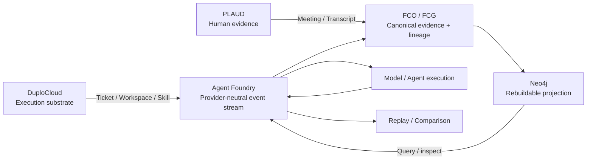

# Agent Foundry

**Debug your AI agents like software.**

Agent Foundry is a local-first, provider-neutral reliability and provenance debugger for AI agents. It records execution as an inspectable event stream so developers can determine where two runs first diverged, what evidence and tools were available, what decision changed, and whether the behavior can be reproduced from a verified state.

## Hack Day demo

The submitted Hack Day demo uses a **deterministic simulation** based on the Moddik plate architecture:

`simulated sensor evidence → HardwareBreakpoint → verified Merkle commitment → Neo4j projection → local Liquid AI ModelEvent → verifier → simulated decision → replay / comparison`

Physical actuation is **NONE**.

The key recorded result is that the first 68 events are identical and the first divergence occurs at event 68: nutrient at tick 9 changes from **10.197 mM** to **12.697 mM**. The nominal run records `MEDIUM_EXCHANGE_RECOMMENDED`; the perturbed run records `NO_INTERVENTION` / abstention. Later sensor endpoints can agree even though the execution paths and downstream decisions remain different.

## How the integrations participate

| Integration | Role in Agent Foundry | What crosses the boundary | Status |
|---|---|---|---|
| **DuploCloud** | External agent-development / execution substrate | ticket, workspace and skill activity → provider-neutral Agent Foundry run context and results | **EXECUTED with explicit direct-skill fallback; Duplo agent dispatch FAILED_AUTH** |
| **PLAUD** | Independent human/audio evidence channel | recording + transcript bytes → human-evidence / contribution metadata | **PARTIAL** — exact supplied bytes hash-verified; FCO/Merkle admission NOT_EXECUTED |
| **Neo4j** | Rebuildable graph projection and query layer | canonical run events + FCO/FCG relationships → inspectable graph | **EXECUTED** |

Detailed evidence and boundaries: [`docs/INTEGRATIONS.md`](docs/INTEGRATIONS.md).

### DuploCloud — execution substrate

The DuploCloud thin adapter defines a typed `AgentFoundryRun` resource. A Duplo ticket maps to an Agent Foundry run, workspace/scope maps to bounded execution context, and the `provision-agentfoundry` skill maps to a capability. In the verified rehearsal, the extension was built and hot-loaded, a run resource was created through the Duplo API, the skill adapter called the canonical Agent Foundry API with a real local Liquid model, and the result was written back into Duplo. The Duplo **agent** lane itself failed with an LLM-gateway 401, so the successful run used an explicitly labeled direct-skill fallback rather than pretending the agent dispatch succeeded.

Receipts:
- `provenance/BREAKPOINT_DUPLO_THIN_EXTENSION_016.json`
- `provenance/rehearsal/duplo_rehearsal_20260929T143948Z.json`
- wrapper repo: `biobitworks/agent-foundry-duplo`

### PLAUD — human evidence channel

PLAUD captured the real team design session independently of software execution. The exact supplied audio and transcript bytes were independently re-hashed and recorded as safe metadata; raw private media remains outside Git. This establishes byte identity for the supplied files, **not** authorship, causality, or a verified platform-side PLAUD lineage.

Current status:
- audio bytes/hash: VERIFIED
- transcript bytes/hash: VERIFIED
- governed PLAUD FCO admission: NOT_EXECUTED
- PLAUD Merkle commitment: NOT_COMPUTED
- speaker-label → named-person mapping: not inferred

Receipt:
- `provenance/plaud/PLAUD_MEETING_BYTES_20260929.json`

### Neo4j — rebuildable inspection graph

Agent Foundry projects canonical run events and FCO/FCG relationships into a project-local Neo4j instance for query and visualization. Neo4j is deliberately **non-canonical**: it can be deleted and rebuilt from governed Agent Foundry artifacts. The verified rehearsal used Neo4j **5.26.24**, rebuilt the projection from the canonical log, and restored identical counts: **91 nodes** (90 events + Run), **299 relationships**, and **0 causal-style edges**.

Receipts:
- `provenance/BREAKPOINT_HACKERSQUAD_E2E_REHEARSAL_018.json`
- `provenance/rehearsal/hackersquad_e2e_20260929T200636Z.json`

## Architecture

Canonical boundaries:

- **Agent Foundry** — developer-facing reliability/debugging product
- **HydraDG** — state / checkpoint / recovery engine
- **Glasswork** — evaluation / comparison engine
- **Ollarma** — local model execution / routing
- **FCO/FCG** — canonical evidence / lineage / custody substrate
- **Neo4j** — rebuildable graph projection
- **DuploCloud** — external execution substrate where materially executed
- **PLAUD** — independent human-evidence ingress

## Provider comparison

A successor comparison lane freezes one Vithia-produced context before inference and gives the exact same bytes to two reasoning backends. On magicPRObox, verified OpenJEV chose **LEFT** while a provisional local LiquidAI arm chose **STAY**; the first behavioral divergence is `DecisionEvent.choice`. OpenJEV's own probabilities tie LEFT and STAY on the primary context, so this is **not** a model-quality claim. The Studio LiquidAI arm remains NOT_TESTED until its runbook is executed and imported.

See:
- `provenance/BREAKPOINT_VITHIA_OPENJEV_LIQUID_COMPARE_001.json`
- `docs/STUDIO_ARM_RUNBOOK.md`

## Provenance discipline

Agent Foundry preserves:

`PROPOSED ≠ IMPLEMENTED ≠ EXECUTED ≠ OBSERVED ≠ SUPPORTED`

and explicit negative states such as `FAILED`, `NOT_TESTED`, `UNKNOWN`, and `NOT_COMPUTED`.

Hashes establish byte identity/deduplication, not truth. Merkle inclusion establishes integrity/custody, not causality. FCG edges record declared relationships; they do not independently prove causality.

## Known limitations

- Moddik workflow is a deterministic simulation; no real Moddik hardware was connected.
- Physical actuation was not performed.
- The simulator does not implement real biological state dynamics.
- IEEE DMF raw frames remain ACCESS_BLOCKED; current admission is metadata-level.
- G*/DeltaG*/S* are NOT_COMPUTED for the current path-divergence analysis.
- Anticube remains UNKNOWN / NOT_COMPUTED where the ontology does not support a classification.
- Studio LiquidAI comparison is NOT_TESTED unless a later verified receipt supersedes this statement.
- No preregistered model-quality evaluation supports declaring OpenJEV or LiquidAI superior.

## Reproduce / inspect

Start with:
- `docs/INTEGRATIONS.md`
- `docs/STUDIO_ARM_RUNBOOK.md`
- `provenance/`
- `scripts/moddik_verify.py`
- `scripts/path_divergence_moddik.py`

## Team

- Byron Lee
- David Ferrick
- Ramon Berguer
