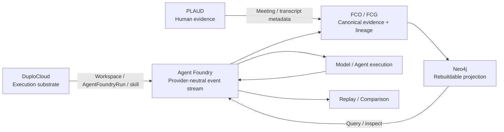

# Agent Foundry

**Debug your AI agents like software.**

Agent Foundry is a local-first, provider-neutral reliability and provenance debugger for AI agents. It records execution as an inspectable event stream so developers can determine where two runs first diverged, what evidence and tools were available, what decision changed, and whether the behavior can be reproduced from a verified state.

> Status: an AI Conference Hack Day 2026 project, **submitted to HackerSquad on 2026-09-29** (operator-reported). This README describes the repository state after submission and only what was executed; each claim links to its receipt in [`provenance/`](provenance/).

## Hack Day demo

A **SIMULATED** Moddik-style cell-culture plate, run entirely locally. **Physical actuation = NONE.** No real Moddik hardware was used, and the Moddik deck is not in this repository.

```
design/source context (deck concepts; deck not committed)
  -> deterministic simulated sensor events (source=SIMULATED, frozen seed)
  -> HardwareBreakpoint over ordered canonical sensor leaves
  -> verified Merkle commitment (root recomputed from stored leaf bytes)
  -> Neo4j rebuildable projection
  -> local Liquid AI ModelEvent (LFM2.5-2.6B via Ollama)
  -> deterministic verifier
  -> simulated decision (MEDIUM_EXCHANGE_RECOMMENDED, never actuated)
  -> controlled replay (one sensor value changed)
  -> first divergence
```

Thresholds are illustrative scenario parameters, not validated biology. A model citing an evidence id shows the id was supplied under the verifier contract, not that the recommendation is correct.

## Key result

| | nominal run | perturbed replay |
|---|---|---|
| events identical before divergence | first 68 | first 68 |
| **first divergence** | event 68 | event 68 |
| nutrient, tick 9 | 10.197 mM | 12.697 mM |
| downstream | `MEDIUM_EXCHANGE_RECOMMENDED` | `NO_INTERVENTION` (abstention; no action derived) |

The breakpoint before the divergence has an identical Merkle root in both runs. In this scripted simulation the tick-10 observation vectors coincide again, yet the path divergence at tick 9 remains, along with a different downstream decision: **later endpoint equality does not erase an earlier path divergence** ([`docs/PATH_DIVERGENCE.md`](docs/PATH_DIVERGENCE.md)). G\*/ΔG\* did not explain this result (they are `NOT_COMPUTED`).

## How the integrations participate

| Integration | Role in Agent Foundry | What crosses the boundary | Status |
| --- | --- | --- | --- |
| **DuploCloud** | External development/execution substrate | workspace/resource/skill execution ↔ canonical Agent Foundry run/result | **PARTIAL** — workspace, extension, ticket creation and result write-back executed; Duplo agent dispatch failed 401 and an explicit direct-skill fallback was used |
| **PLAUD** | Human evidence and contribution channel | exact recording/transcript metadata → contribution/design evidence | **PARTIAL** — real audio/transcript bytes independently hash-verified; real addendum/FCO/Merkle admission not executed |
| **Neo4j** | Rebuildable graph projection and query layer | canonical FCO/FCG/run events → inspectable graph | **EXECUTED** — project-local projection/query/delete/rebuild verified |



**Neo4j is a rebuildable projection, not the canonical FCG. DuploCloud supplies execution context where verified. PLAUD supplies independent human evidence. Provenance relationships do not independently prove causality.**

See [docs/ARCHITECTURE.md](docs/ARCHITECTURE.md) for the receipt-level integration boundaries.

## Provider comparison

A comparison freezes **one Vithia-produced context before inference** and gives the exact same bytes to two backends. The frozen context is 835 bytes, sha256 `0748ed93…8402` (raw control: 451 bytes, `a0098d37…5068`); both arms report the same hash.

- **OpenJEV** (verified MLX 4-bit runtime, magicPRObox): primary choice `LEFT`, with probabilities LEFT 0.4242 / STAY 0.4242 / RIGHT 0.1515. **LEFT and STAY are a top-probability tie**, so LEFT is a tie-break.
- **LiquidAI, provisional** (LFM2.5-1.2B-Instruct via Ollama, magicPRObox): primary choice `STAY`.
- **First behavioral divergence: `DecisionEvent.choice`.**
- Neither backend has an evidence-citation channel in this typed-choice contract, so **evidence used = `NOT_AVAILABLE`**; only the supplied evidence is recorded (identical for both).
- **No model-quality conclusion is supported**: n=1 per arm, no preregistered evaluation.
- The Studio LiquidAI arm remains **`NOT_TESTED`** (Studio was unreachable), and the earlier route `OPENJEV_STUDIO_CONNECTIVITY=FAILED` is preserved as a receipt. The Pro-local Liquid arm is labelled `LIQUIDAI_PRO_LOCAL_PROVISIONAL` and is not presented as the Studio arm.

Vithia and OpenJEV come from the operator's `biobitworks/jev-space-invaders` repository, pinned read-only at `dbca313`; the evidence is `VITHIA_DAISY_ECA_ACTION_CORPUS_V1` (CC-BY-4.0, bytes not committed). See [`docs/VIDEO_SEGMENT_CONTEXT_COMPARE.md`](docs/VIDEO_SEGMENT_CONTEXT_COMPARE.md).

## Architecture

| Component | Role | Status in this repository |
|---|---|---|
| **Agent Foundry** | developer-facing run / debugging / replay product (event schema, recorder, comparison, inspector) | implemented |
| HydraDG | state / checkpoint / recovery engine | consumed conceptually; adapter **NOT_IMPLEMENTED** (checkpoint/replay here is native) |
| Glasswork | evaluation / comparison engine | adapter **NOT_IMPLEMENTED** (comparison here uses Agent Foundry's own machinery) |
| Ollarma | local model routing / execution | adapter **NOT_TESTED** (local models were called through Ollama directly) |
| FCO/FCG | evidence / lineage / custody substrate | objects staged here using the pinned FCO schema (v1.3.0) and FCG ontology names; canonical-repo bridge **NOT_IMPLEMENTED** |
| Neo4j | **rebuildable projection / query layer, not canonical provenance** | executed; delete -> rebuild verified |
| Vithia | preprocessing / context construction in the demonstrated comparison | executed (pinned upstream) |

Integrations with executed receipts include **Neo4j** (projection/rebuild/query), **Liquid AI** (real local inference), **OpenJEV** (provider comparison), and a **separate DuploCloud thin-extension path** (workspace/extension/resource creation/result write-back with explicit direct-skill fallback; Duplo agent dispatch `FAILED_AUTH`). DuploCloud was not part of the submitted Moddik run. **PLAUD** contributes the independent human-evidence lane: exact real recording/transcript bytes are hash-verified post-submission, while canonical addendum/FCO/Merkle admission remains unexecuted. Not used: Similarweb, OpenRouter, Crusoe, Vultr, Band, Merge.dev, Nebius, Brave, UserTesting (`NOT_USED`).

## Provenance discipline

`PROPOSED != IMPLEMENTED != EXECUTED != OBSERVED != SUPPORTED`, and failed, null, negative, deferred, not-tested, unknown and not-computed states are kept, not upgraded.

- A hash identifies bytes; it does not establish truth.
- Merkle inclusion establishes integrity/custody over declared leaves; it does not establish sensor truth or causality.
- FCG edges and Neo4j edges declare relationships; they do not prove causality.
- The canonical evidence is the recorded run logs and FCO/FCG files; deleting the Neo4j projection loses nothing.

## Reproduce

Python 3.13 with the packages in `requirements.txt`. Recorded runs need no model or network; live runs need Ollama.

```bash
make test                                             # full suite (Neo4j-dependent tests skip if it is not running)
scripts/moddik_neo4j.sh up                            # project-local Neo4j (credentials generated locally, never printed)
python3 scripts/moddik_verify.py --neo4j              # Moddik: Merkle recompute + Neo4j delete -> rebuild
python3 scripts/path_divergence_moddik.py verify      # path-divergence diagnostic
python3 scripts/ieee_dmf_admit.py verify              # IEEE DataPort metadata-level admission
python3 scripts/compare_context.py verify             # frozen-context comparison
python3 -m uvicorn api.server:app --host 127.0.0.1 --port 8765
# open http://localhost:8765/?moddik=recorded:rehearsal_1   (buttons: Moddik plate demo | Compare backends | Dataset custody)
gitleaks detect --no-git --source . --redact
```

More: [`docs/DEMO_RUNBOOK.md`](docs/DEMO_RUNBOOK.md), [`docs/MODDIK_MVP_DESIGN.md`](docs/MODDIK_MVP_DESIGN.md), [`docs/PATH_DIVERGENCE.md`](docs/PATH_DIVERGENCE.md), [`docs/IEEE_DMF_ADMISSION.md`](docs/IEEE_DMF_ADMISSION.md), [`docs/VIDEO_SEGMENT_CONTEXT_COMPARE.md`](docs/VIDEO_SEGMENT_CONTEXT_COMPARE.md), and the optional operator step [`docs/STUDIO_ARM_RUNBOOK.md`](docs/STUDIO_ARM_RUNBOOK.md). Receipts and breakpoints: [`provenance/`](provenance/).

## Known limitations

- The Moddik workflow is a **deterministic simulation**; the simulator has **no real state dynamics** (readings are scripted per tick), so a perturbation does not propagate.
- IEEE DataPort "Digital Microfluidics Datasets": metadata-level admission only; **raw data `ACCESS_BLOCKED`** (login required), so no sample or frame atoms and no vector analysis (`DEFERRED_ACCESS`).
- G\*/ΔG\* = `NOT_COMPUTED` in the path-divergence analysis; S\*, P(Γ) not computed; Anticube comparison is `UNKNOWN`/`NOT_COMPUTED` where no predicates were assessed.
- Studio LiquidAI comparison: `NOT_TESTED`. Live ASR: `NOT_TESTED` (engine smoke on synthetic speech only, on a separate branch).
- **PLAUD**: an exported-audio custody importer is implemented and unit-tested. Real meeting audio/transcript exact bytes were independently hash-verified post-submission and only public-safe metadata is committed; canonical addendum/FCO admission remains `NOT_EXECUTED` and governed PLAUD Merkle custody is **not** claimed. Raw private artifacts stay outside Git.
- No preregistered model-quality evaluation exists; comparisons are single-run behavioral observations.

## Licenses and sources

Third-party material is referenced, not vendored: Liquid AI weights (LFM Open License), OpenJEV weights (CC BY-NC 4.0, not redistributed here), the Daisy ECA corpus (CC-BY-4.0), and IEEE DataPort metadata (source page and payload bytes not committed; license declared CC BY 4.0 in page metadata, unverified). Source intake: [`docs/source_intake.manifest.jsonl`](docs/source_intake.manifest.jsonl). This repository's own license has not been selected yet.

## Security

No credentials are committed. Neo4j credentials are generated into a gitignored local file and never printed; the OpenJEV shim token is read in-process and never stored. Private audio/transcripts and secrets stay outside public source. Secret scan: see [`docs/GITLEAKS_TRIAGE.md`](docs/GITLEAKS_TRIAGE.md).

## Team

Byron Lee, David Ferrick, Ramon Berguer
