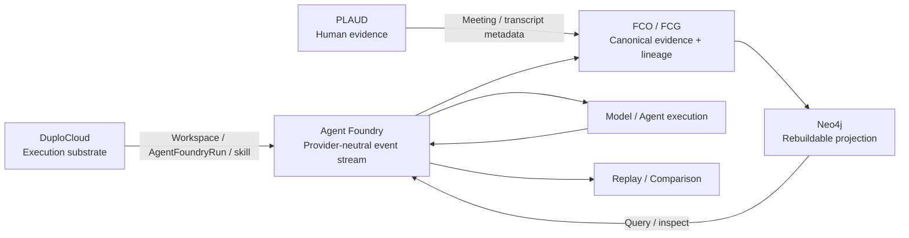

# Agent Foundry

**Debug your AI agents like software.**

Agent Foundry is a local-first, provider-neutral reliability and provenance debugger for AI agents. It records execution as an inspectable event stream so developers can determine **where two runs first diverged, what evidence and tools were available, what decision changed, and whether the behavior can be reproduced from a verified state**.

## Hack Day demo

The submitted demo uses a deterministic **simulated** autonomous-biology workflow based on the Moddik plate architecture:

```text
simulated sensor events
    ↓
HardwareBreakpoint + verified Merkle commitment
    ↓
Neo4j rebuildable inspection projection
    ↓
local Liquid AI ModelEvent
    ↓
verifier
    ↓
simulated decision
    ↓
controlled replay / first-divergence localization
```

Physical actuation is **NONE**. The demo does not claim real Moddik hardware execution.

### Key result

The nominal and perturbed runs share the same first 68 events. The first divergence is event 68 at nutrient tick 9:

- nominal: **10.197 mM**
- perturbed: **12.697 mM**

The nominal path records `MEDIUM_EXCHANGE_RECOMMENDED`; the perturbed path records no intervention / abstention. Later sensor endpoints can agree again while the execution histories remain different. **Endpoint equality does not imply path equality.**

## How the integrations participate

| Integration | Role in Agent Foundry | What crosses the boundary | Status |
| --- | --- | --- | --- |
| **DuploCloud** | External development/execution substrate | workspace/resource/skill execution ↔ canonical Agent Foundry run/result | **PARTIAL** — workspace, extension, ticket creation and result write-back executed; Duplo agent dispatch failed 401 and an explicit direct-skill fallback was used |
| **PLAUD** | Human evidence and contribution channel | exact recording/transcript metadata → contribution/design evidence | **PARTIAL** — real audio/transcript bytes independently hash-verified; real addendum/FCO/Merkle admission not executed |
| **Neo4j** | Rebuildable graph projection and query layer | canonical FCO/FCG/run events → inspectable graph | **EXECUTED** — project-local projection/query/delete/rebuild verified |



**Neo4j is a rebuildable projection, not the canonical FCG. DuploCloud supplies execution context where verified. PLAUD supplies independent human evidence. Provenance relationships do not independently prove causality.**

See [docs/ARCHITECTURE.md](docs/ARCHITECTURE.md) for the receipt-level integration boundaries.

## DuploCloud

The Hack Day integration uses a thin DuploCloud extension rather than moving Agent Foundry logic into the platform. The `extension-dev` workspace was verified through the Duplo API, the extension was built/hot-loaded, an Agent Foundry resource was created, and the fallback skill path invoked the canonical Agent Foundry API and wrote the result back to Duplo. The Duplo **agent** lane itself failed LLM-gateway authentication and remains preserved as a failure rather than being upgraded to a successful dispatch.

Receipts: `provenance/BREAKPOINT_DUPLO_THIN_EXTENSION_016.json` and `provenance/rehearsal/duplo_rehearsal_20260929T143948Z.json`.

## PLAUD

PLAUD is the independent human-evidence lane. The real team audio and transcript supplied for review were independently re-hashed from exact bytes; raw private media is not committed. The repository contains an importer/runbook, but the real recording was **not** admitted as a canonical Agent Foundry addendum/FCO and no PLAUD Merkle root is claimed.

Public-safe receipt: `provenance/plaud/real_capture_verification_20260929.json`.

## Neo4j

Agent Foundry projects canonical run events and FCO/FCG objects into Neo4j for interactive inspection. The graph can be deleted and rebuilt from canonical artifacts. In the recorded rehearsal Neo4j 5.26.24 was exercised on the project-local instance; the Moddik view recorded 91 nodes / 299 relationships. The later provider-comparison projection independently rebuilt to 62 nodes / 111 relationships with the FCO/FCG subgraph fingerprint unchanged and zero causal-like edges.

Neo4j is therefore a **query/visualization projection**, not the source of truth.

## Vithia / OpenJEV / Liquid comparison

A successor comparison freezes one Vithia-produced context **before** model execution and supplies the same bytes to two backends:

- primary Vithia context: 835 bytes, SHA-256 `0748ed93c648903e64aa5295bc75cd4c5c979b089065a2447e250e06d5f88402`
- OpenJEV on magicPRObox: `LEFT`, with LEFT/STAY tied at 0.4242
- provisional local LiquidAI arm on magicPRObox: `STAY`
- first behavioral divergence: `DecisionEvent.choice`

This is **not** a model-quality claim. It is n=1 per arm, the OpenJEV primary decision is a probability tie-break, and neither typed-choice backend exposes an evidence-citation channel. The Studio LiquidAI arm remains `NOT_TESTED` unless a successor receipt proves otherwise.

## Architecture

- **Agent Foundry** — developer-facing reliability/debugging product
- **HydraDG** — state / checkpoint / recovery engine
- **Glasswork** — evaluation / comparison engine
- **Ollarma** — local model execution / routing layer
- **FCO/FCG** — canonical evidence / lineage / transformation / claim-custody substrate
- **DuploCloud** — external Hack Day execution/development substrate
- **PLAUD** — independent human/audio evidence ingress
- **Neo4j** — rebuildable graph projection / visualization / query substrate
- **Vithia** — bounded preprocessing/context construction in the provider-comparison lane

## Provenance discipline

Agent Foundry preserves the distinction:

`PROPOSED != IMPLEMENTED != EXECUTED != OBSERVED != SUPPORTED`

and retains `FAILED`, `NULL`, `NEGATIVE`, `DEFERRED`, `NOT_TESTED`, `UNKNOWN`, and `NOT_COMPUTED` states.

Hashes establish byte identity/deduplication, not truth. Merkle inclusion establishes integrity/custody over declared leaves, not causality or correctness. FCG edges declare relationships; they do not independently prove causality.

## Reproduce / inspect

- `docs/DEMO_RUNBOOK.md`
- `docs/HACKERSQUAD_VIDEO_SCRIPT.md`
- `docs/PATH_DIVERGENCE.md`
- `docs/STUDIO_ARM_RUNBOOK.md`
- `docs/PLAUD_CUSTODY_RUNBOOK.md`
- `provenance/`

## Known limitations

- Moddik execution is a deterministic simulation; real hardware is not connected.
- The current simulator is not a physical dynamical model.
- IEEE DMF raw frames remain access-blocked; the admitted lane is metadata-level only.
- `G*` / `DeltaG*` remain `NOT_COMPUTED` for the current path-divergence analysis.
- Anticube fields remain unknown/not-computed where the current ontology does not support them.
- DuploCloud agent dispatch failed gateway authentication; the preserved successful path is an explicit direct-skill fallback through the Duplo resource.
- Real PLAUD audio/transcript hashes are verified, but canonical addendum/FCO/Merkle admission is not executed.
- No preregistered model-quality evaluation supports ranking OpenJEV versus LiquidAI.

## Security and privacy

Secrets, API keys, passwords, private signing keys, and raw PLAUD media are not committed. Credential availability is represented as presence/absence rather than retaining values.

## Team

- Byron Lee
- David Ferrick
- Ramon Berguer
