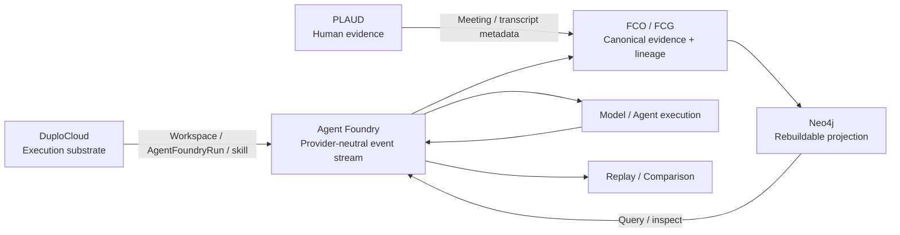

# Agent Foundry architecture

Agent Foundry is the developer-facing debugging layer. It normalizes execution into inspectable events, preserves evidence/lineage through FCO/FCG, projects that state into Neo4j for inspection, and keeps external execution and human-evidence systems at explicit boundaries.



## Integration boundaries

### DuploCloud — external execution substrate

**Status: PARTIAL, materially participating.**

The preserved Hack Day receipts show a real DuploCloud platform path: the `extension-dev` workspace was verified through the platform API; the Agent Foundry extension was built and hot-loaded; creating an `AgentFoundryRun` through the Duplo API returned HTTP 201; and an explicit direct-skill fallback invoked the canonical Agent Foundry API and wrote the resulting comparison summary back into the Duplo resource as `Complete`.

The limitation is important: the Duplo **agent** lane did not dispatch the skill because its LLM gateway returned `401 Missing Authentication header`. The fallback was labeled explicitly and the failure remains preserved.

Executed boundary:

```text
Duplo extension-dev workspace
        ↓
AgentFoundryRun typed resource / ticket
        ↓
provision-agentfoundry capability
        ↓
canonical Agent Foundry API
        ↓
provider-neutral Agent Foundry run/model/comparison
        ↓
summary written back to Duplo result
```

The broader mapping remains the architecture contract:

| DuploCloud concept | Agent Foundry concept | Current status |
| --- | --- | --- |
| Ticket / `AgentFoundryRun` | Run boundary | EXECUTED, but resource id is not retained in the canonical receipt |
| Provider / scope | ExecutionContext | PARTIAL |
| Skill | Capability | EXECUTED via explicit direct fallback |
| Persona | AgentRole / policy | NOT_TESTED |
| Workspace | ExecutionEnvironment | EXECUTED / verified by platform API |
| MCP call | ToolEvent | NOT_OBSERVED in the canonical Duplo receipt |
| Model output | ModelEvent | EXECUTED in the canonical Agent Foundry run invoked by the skill |
| Retrieval | EvidenceEvent | NOT_TESTED |
| Checkpoint | ReplayCheckpoint | NOT_TESTED |
| Comparison | Evaluation/comparison result | EXECUTED by Agent Foundry and written back to Duplo |

Receipts: `provenance/BREAKPOINT_DUPLO_THIN_EXTENSION_016.json`, `provenance/rehearsal/duplo_rehearsal_20260929T143948Z.json`, and `provenance/DUPLOCLOUD_UPSTREAM_LOCK.json`.

### PLAUD — human evidence ingress

**Status: PARTIAL.**

A real team audio file and transcript were independently re-hashed from exact operator-provided bytes during the post-submission review:

- audio: 15,224,876 bytes, SHA-256 `bf9bb0284597f8820981b54292127104875b5a27f5d3f673ad28791db49fe55d`
- transcript: 77,153 bytes, SHA-256 `49ec64d89419aea86a91373e8c6f159c31db595c926b3627f89d2939a40fee15`

Raw audio and transcript are not committed. The importer is implemented, but the real recording has **not** been admitted into a canonical Agent Foundry addendum/FCO in the preserved repository state, and no PLAUD Merkle root is claimed.

Intended contribution route:

```text
MeetingSession / AudioArtifact / TranscriptArtifact
        ↓
timestamped TranscriptSegment
        ↓ INFORMED
DesignDecision
        ↓ IMPLEMENTED_AS
CodeArtifact
        ↓ OBSERVED_IN
AgentFoundryRun
```

Provenance is not causality: the project does not use `CAUSED_BY` merely because a discussion preceded an implementation. Generic transcript speakers remain generic unless separately verified.

Receipt: `provenance/plaud/real_capture_verification_20260929.json`. Import semantics: `docs/PLAUD_CUSTODY_RUNBOOK.md`.

### Neo4j — rebuildable inspection graph

**Status: EXECUTED.**

Neo4j is deliberately **not** the canonical FCG. Agent Foundry projects canonical event streams and FCO/FCG objects into a project-local Neo4j instance for querying and visualization.

The recorded HackerSquad rehearsal used Neo4j 5.26.24 on the project-local instance and verified delete → rebuild behavior. The Moddik rehearsal recorded 91 nodes / 299 relationships with zero causal-style edges. The later Vithia/OpenJEV/Liquid comparison independently verified a 62-node / 111-relationship projection; deleting the admission reduced it to zero nodes, rebuilding restored 62 nodes, the FCO/FCG subgraph fingerprint matched, unrelated nodes were untouched, and causal-like edges remained zero.

```text
canonical event/FCO/FCG artifacts
        ↓
Neo4j projection
        ↓
query / inspect / visualize
        ↓
delete project projection
        ↓
rebuild from canonical artifacts
        ↓
same governed projection
```

Neo4j supports run-timeline inspection, evidence relationships, model/decision relationships, first-divergence localization, nominal-vs-perturbed paths, provider comparison, and external dataset custody views.

Receipts: `provenance/rehearsal/hackersquad_e2e_20260929T200636Z.json`, `provenance/moddik/verification_20260929T191609Z.json`, and `provenance/context_compare/context_compare_verification_20260929T222545Z.json`.

## Canonical-state rule

- **DuploCloud** can execute/host the agent workflow; it is not provenance authority.
- **PLAUD** supplies human evidence; hashes identify exact reviewed bytes but do not prove authorship or semantic truth.
- **Neo4j** makes relationships inspectable; it is rebuildable and non-canonical.
- **FCO/FCG + Agent Foundry event artifacts** retain canonical evidence, lineage, and execution custody.

Always preserve: `PROPOSED != IMPLEMENTED != EXECUTED != OBSERVED != SUPPORTED`.
