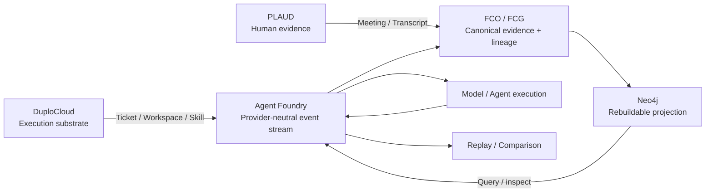

# Agent Foundry integrations

This document records how the Hack Day integrations participate in Agent Foundry and distinguishes execution evidence from architectural intent.

## Status summary

| Integration | Role | Status | Receipt / evidence |
|---|---|---|---|
| DuploCloud | External agent-development and execution substrate | EXECUTED with explicit direct-skill fallback; Duplo agent dispatch FAILED_AUTH | `provenance/BREAKPOINT_DUPLO_THIN_EXTENSION_016.json`; `provenance/rehearsal/duplo_rehearsal_20260929T143948Z.json`; wrapper `biobitworks/agent-foundry-duplo` |
| PLAUD | Independent human/audio evidence ingress | PARTIAL: exact audio and transcript bytes independently hash-verified; governed FCO/Merkle admission NOT_EXECUTED | `provenance/plaud/PLAUD_MEETING_BYTES_20260929.json`; raw private media intentionally not tracked |
| Neo4j | Rebuildable projection / query / visualization substrate | EXECUTED | `provenance/BREAKPOINT_HACKERSQUAD_E2E_REHEARSAL_018.json`; `provenance/rehearsal/hackersquad_e2e_20260929T200636Z.json` |

## DuploCloud — execution substrate

DuploCloud is an external Hack Day execution substrate, not the canonical provenance authority.

The Duplo thin-adapter extension defines a typed `AgentFoundryRun` resource. A Duplo ticket maps to an Agent Foundry run; workspace/scope maps to bounded execution context; the `provision-agentfoundry` skill maps to a capability. The skill calls the canonical Agent Foundry API and writes the returned comparison summary back to Duplo rather than reimplementing comparison logic.

The verified rehearsal created a resource through the Duplo API, produced `TicketCreated`, executed the skill adapter through an explicitly labeled direct fallback, called the canonical Agent Foundry API with a real local Liquid model, and wrote the result back into Duplo. The Duplo agent lane itself did **not** dispatch the skill because its LLM gateway returned HTTP 401. That failure is preserved.

Provider-neutral mapping:

- Duplo Ticket → AgentFoundry Run
- Provider / Scope → ExecutionContext
- Skill → Capability
- Workspace → bounded ExecutionEnvironment
- MCP / external operation → ToolEvent when captured
- model output → ModelEvent when captured
- retrieval → EvidenceEvent when captured
- checkpoint → ReplayCheckpoint when captured
- comparison → EvaluationEvent when captured

Do not describe authentication, installation, or HTTP 200 alone as material integration.

## PLAUD — human evidence channel

PLAUD is the human-evidence ingress lane, not the reasoning backend or graph store.

The real Hack Day meeting export and transcript were independently re-hashed from the exact operator-provided files. The hashes and byte counts are recorded in `provenance/plaud/PLAUD_MEETING_BYTES_20260929.json`. The raw audio and transcript remain private and outside Git.

Current custody level:

- real recording bytes present and hash-verified
- real transcript bytes present and hash-verified
- relationship to team design discussion: operator-attested / transcript-supported
- governed FCO admission: NOT_EXECUTED
- PLAUD Merkle commitment: NOT_COMPUTED
- speaker-label → named-person mapping: not inferred without independent evidence

Intended contribution route:

`SpeakerLabel / TeamMember → CONTRIBUTED_TO → TranscriptSegment → INFORMED → DesignDecision → IMPLEMENTED_AS → CodeArtifact → OBSERVED_IN → AgentFoundryRun`

These are provenance relationships; they do not independently prove causality.

## Neo4j — rebuildable inspection graph

Neo4j is a rebuildable graph projection and query layer. It is **not** the canonical FCG.

Agent Foundry projects canonical run events and FCO/FCG relationships into a project-local Neo4j instance for interactive inspection. In the verified HackerSquad rehearsal, Neo4j 5.26.24 ran on loopback, the projection contained 91 nodes (90 events + Run) and 299 relationships, deletion reduced run nodes to zero while shared nodes remained, and rebuilding from the canonical log restored identical counts. The canonical log hash remained unchanged and the projection contained 0 causal-style edges.

This supports:

- run timeline inspection
- evidence and model-event relationships
- first-divergence localization
- nominal vs perturbed path comparison
- Vithia / OpenJEV / Liquid backend comparison
- external-dataset custody projections

For the Moddik replay, events 0–67 are identical and event 68 is the first divergence (nutrient tick 9: 10.197 → 12.697 mM), after which the downstream decision path differs.

## Architecture

Neo4j is rebuildable, not canonical. DuploCloud provides execution context where materially executed. PLAUD supplies independent human evidence. FCO/FCG remains the canonical evidence and lineage substrate.
